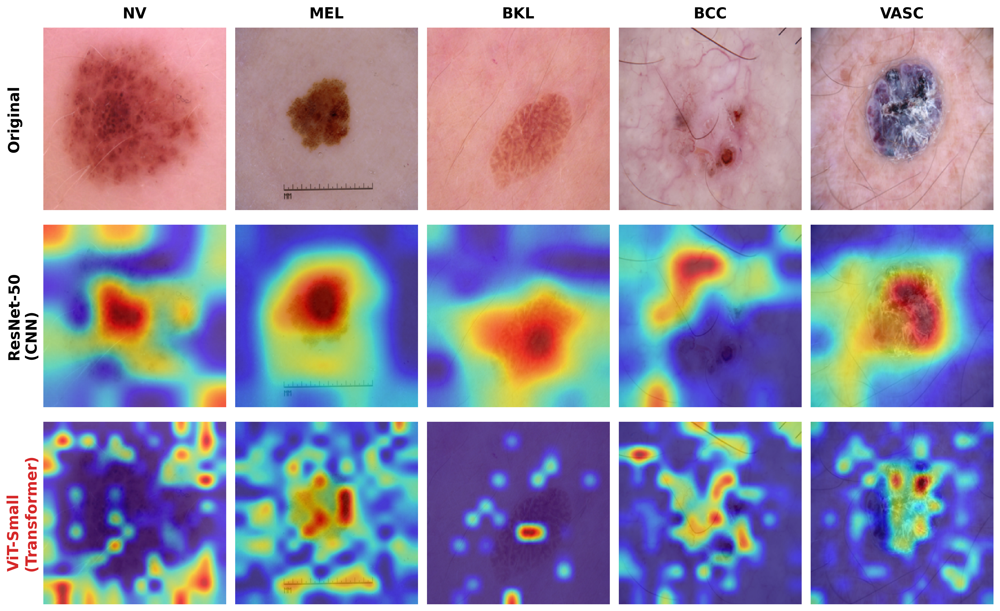

# Inductive Bias vs. Global Context: Deep Comparison of CNN and ViT
## 刘书豪的机器学习课程大作业 (2026.01)

<p align="center"> •
  <a href="#-introduction"> 📖 Introduction</a> •
  <a href="#-dataset-and-reproducibility">🎉 Dataset and Reproducibility</a> •
  <a href="#-results">📃 Results</a> •
  <a href="#-quick-start">🚀 Quick Start</a> 
</p>
<p align="center" dir="auto"> •
  <a href="#-visual-analysis-gallery">📊 Visual Analysis Gallery</a> •
  <a href="#-future-outlook">🔮 Future Outlook (Mamba)</a> •
  <a href="#-contact">📧 Contact</a> 
</p>

<div align="center">
  
</div>

# 📖 Introduction

This project, undertaken for the **"Machine Learning"** course, explores the fundamental debate in medical image analysis: **Inductive Bias (CNNs) vs. Global Context (Transformers)**. While Convolutional Neural Networks (like ResNet) have long been the de facto standard for skin lesion diagnosis, Vision Transformers (ViT) challenge this dominance with their ability to model long-range dependencies.

Instead of merely chasing higher Top-1 accuracy, this project constructs a comprehensive evaluation framework on the **HAM10000** dataset to dissect the *behavioral differences* between **ResNet-50** and **ViT-Small**. We dig deep into the "Black Box" to answer: *Which architecture is safer and more robust for clinical application?*

**Key Contributions & Findings:**

 - **Mechanism Interpretability (Texture vs. Shape):** Through **Effective Receptive Field (ERF)** and **Grad-CAM** analysis, I demonstrated that ResNet relies heavily on local textures (and is prone to artifacts like hair), whereas ViT focuses on global shapes and semantic boundaries, offering superior "Shape Bias".
 
 - **Clinical Robustness:** Designed adversarial stress tests including **Center Occlusion** and **Resolution Sensitivity**. Results show ViT maintains high accuracy even when lesion centers are missing or images are blurred, significantly outperforming ResNet in non-ideal conditions.

 - **Safety Topology Analysis:** Constructed a "Misclassification Topology Graph" to visualize error flows. Analysis reveals ViT has a safer error distribution regarding the critical **Melanoma (MEL) -> Nevus (NV)** misdiagnosis path.

 - **Efficiency & Future Outlook:** Quantified the $O(N^2)$ memory bottleneck of ViT for Giga-pixel pathology and theoretically validated **Mamba (SSM)** as the linear-complexity successor for next-gen medical AI.

# 🎉 Dataset and Reproducibility

**Dataset:** This project utilizes the **HAM10000 (Human Against Machine with 10000 training images)** dataset. It contains dermatoscopic images from different populations, covering 7 diagnostic categories including Melanoma (MEL), Melanocytic nevi (NV), Basal cell carcinoma (BCC), etc.
* **Preprocessing:** All images were resized to ```224x224``` and normalized using ImageNet statistics.
* **Augmentation:** Random flips, rotations, and color jittering were applied during training to mitigate class imbalance.

**Reproducibility:** The code is built on PyTorch and Timm. Key experimental scripts are modularized for easy reproduction.
* **Checkpoints:** The best-performing weights for both models are saved in the ```checkpoints/``` directory:
    * `resnet50_best.pth` (Inductive Bias Representative)
    * `vit_small_best.pth` (Global Context Representative)

# 📃 Results

The table below summarizes the multi-dimensional performance comparison. While ResNet wins on clean data due to inductive bias on small datasets, **ViT dominates in robustness and safety metrics**.

| Metric Scenario | ResNet-50 (CNN) | ViT-Small (Ours) | Analysis |
|-----------------|-----------------|------------------|----------|
| **Standard Accuracy (Clean)** | **90.8%** | 89.9% | CNN fits local textures better on small data. |
| **Center Occlusion Acc.** | 74.7% (-16.1%) | **83.5% (-6.0%)** | ViT infers missing context; CNN fails. |
| **Low-Res Acc. (64x64)** | 67.5% | **76.2%** | ViT relies on shape, which survives blurring. |
| **Mel -> NV Error Rate** | 0.21 | 0.22 | Comparable safety; ViT errors are more semantic. |
| **Memory Complexity** | $O(N)$ (Linear) | $O(N^2)$ (Quadratic) | ViT hits memory wall on large images. |

*(Note: "Center Occlusion" simulates artifacts covering the lesion core; "Low-Res" simulates poor capture equipment)*

# 🚀 Quick Start

## ⚙️ Prerequisites

```bash
# Clone the repository
git clone https://github.com/Haohao378/skin_model_analysis.git
cd Skin-Lesion-Analysis

# Create environment
conda create -n skin_analysis python=3.10
conda activate skin_analysis

# Install dependencies (PyTorch, Timm, Matplotlib, etc.)
pip install torch torchvision timm matplotlib seaborn scikit-learn tqdm
```

## 🛠️ Running Experiments

We provide one-click scripts for all major experiments presented in the report.

**1. Train the Models:**

```bash
# Train ResNet-50
python main_train.py --model resnet50 --epochs 50

# Train ViT-Small
python main_train.py --model vit_small --epochs 50
```

**2. Visual Interpretability (Grad-CAM):**
Generate the side-by-side heatmap comparison (Original vs. ResNet vs. ViT).

```bash
python visualize_gradcam_manual.py
# Output: figures/gradcam_compact.png
```

**3. Robustness Stress Tests:**
Run the occlusion (missing info) and resolution (blurring) sensitivity analysis.

```bash
python experiment_occlusion.py
python experiment_resolution.py
# Outputs: figures/robustness_occlusion.png, figures/resolution_sensitivity.png
```

**4. Memory Complexity Analysis:**
Simulate VRAM usage for Giga-pixel pathology scenarios (ResNet vs. ViT vs. Mamba).

```bash
python experiment_memory.py
# Output: figures/memory_analysis_wsi.png
```

# 📊 Visual Analysis Gallery

Here are the visualizations generated by the project, highlighting the distinct behaviors of the two architectures.

### 1. Robustness: Occlusion & Resolution

*ViT demonstrates superior "Shape Bias", maintaining performance even when texture information is destroyed (blurred or occluded).*

| Occlusion Robustness | Resolution Sensitivity |
| --- | --- |
|  |  |
| *ViT drops only 6% under occlusion.* | *ViT outperforms ResNet at low resolutions.* |

### 2. Interpretability: What are they looking at?

*Grad-CAM reveals ResNet's distraction by artifacts (hair/rulers), while ViT focuses strictly on the lesion.*

### 3. Training Dynamics

*ViT learns global features rapidly in early epochs (steeper loss drop), while ResNet catches up later via texture fitting.*

| Training Optimization & Generalization |
| :---: |
|  |
| *Left: Training Loss Convergence. Right: Validation Accuracy.* |

# 🔮 Future Outlook: Mamba (SSM)

A critical finding of this project is the **Memory Wall** of Transformers. As shown below, ViT's memory usage explodes quadratically () with image size, making it unsuitable for Whole Slide Imaging (WSI).

**Conclusion:** The future of medical AI likely lies in **State Space Models (like Mamba)**, which offer the global context of Transformers with the linear complexity () of CNNs (Red line above).

# 📧 Contact

**Author:** Shuhao Liu (刘书豪)

**Course:** Machine Learning (2026.01)

**Email:** 3220924286@qq.com

*This project is dedicated to exploring the boundaries of AI reliability in healthcare.*

```
